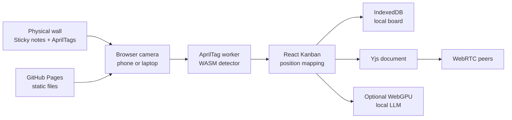

# Physical Kanban Sync


Live site: https://baditaflorin.github.io/physical-kanban-sync/

Repository: https://github.com/baditaflorin/physical-kanban-sync

Support: https://www.paypal.com/paypalme/florinbadita

Physical Kanban Sync turns AprilTag-labeled sticky notes on a wall into a browser-based digital Kanban with local persistence, peer-to-peer visibility, and optional local WebGPU assistance.


## Quickstart

```sh
npm install
make install-hooks
make dev
make smoke
```

## What Works In V1

- Browser camera scanning through a vendored AprilTag 36h11 WASM detector.
- Editable sticky-note Kanban with drag/drop, local IndexedDB persistence, JSON backup, and printable tag kit.
- Yjs + WebRTC room sync loaded on demand.
- Optional WebGPU local LLM summary using WebLLM, loaded only after pressing Assist.
- GitHub Pages build in `docs/` with visible version and commit metadata.

## Architecture



Architecture docs: https://github.com/baditaflorin/physical-kanban-sync/blob/main/docs/architecture.md

ADRs: https://github.com/baditaflorin/physical-kanban-sync/tree/main/docs/adr

Deploy guide: https://github.com/baditaflorin/physical-kanban-sync/blob/main/docs/deploy.md

Privacy notes: https://github.com/baditaflorin/physical-kanban-sync/blob/main/docs/privacy.md

## Self-hosted WebRTC infrastructure

This app uses three small services to discover and relay peers. By default they point at the maintainer's self-hosted stack at `turn.0docker.com`; override with `VITE_WEBRTC_SIGNALING` / `VITE_TURN_TOKEN_URL` at build time, or with localStorage at runtime.

| Repo | Role | Endpoint |
|---|---|---|
| [signaling-server](https://github.com/baditaflorin/signaling-server) | y-webrtc WebSocket peer discovery | `wss://turn.0docker.com/ws` |
| [turn-token-server](https://github.com/baditaflorin/turn-token-server) | Time-limited HMAC TURN credentials | `https://turn.0docker.com/credentials` |
| [coturn-hetzner](https://github.com/baditaflorin/coturn-hetzner) | TURN relay for cross-NAT peers | `turn:turn.0docker.com:3479` |

The previous library defaults (`wss://signaling.yjs.dev`, `wss://y-webrtc-signaling-eu.herokuapp.com`) are dead Heroku apps whose DNS no longer resolves. Stale URLs are auto-migrated out of localStorage by `src/features/sync/meshConfig.ts`.

## Local Checks

```sh
make fmt
make lint
make test
make build
make smoke
```

## Git Hooks

```sh
make install-hooks
```

Hooks live in `.githooks/` and run formatting, linting, TypeScript, tests, Pages build, smoke checks, gitleaks, and Conventional Commit validation locally. There are no GitHub Actions in v1.
