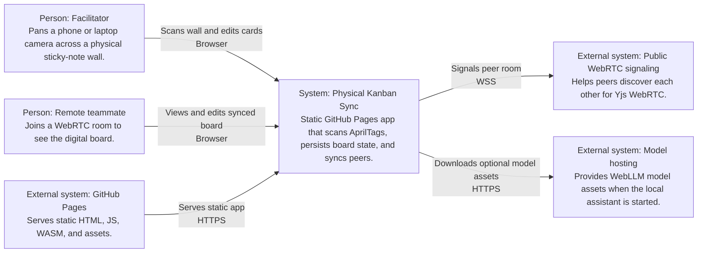
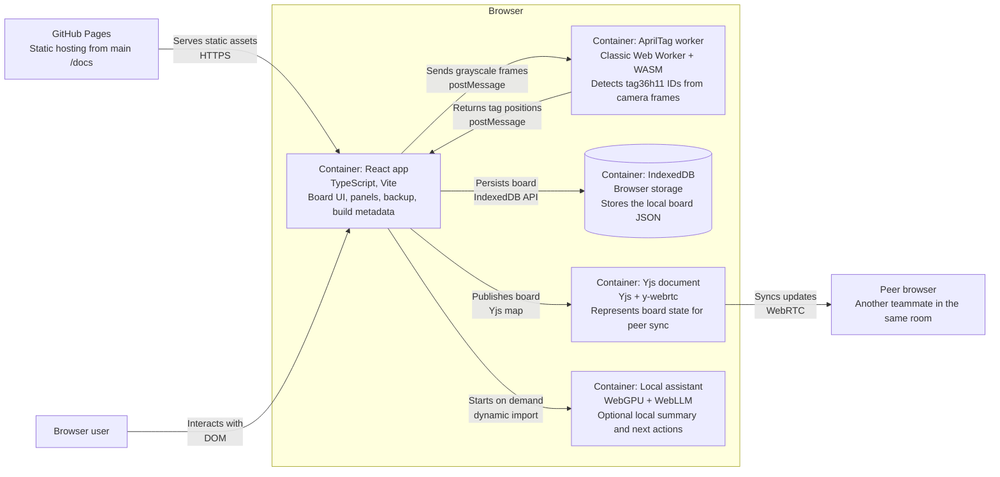

# Architecture

## Context

Live GitHub Pages boundary: https://baditaflorin.github.io/physical-kanban-sync/

Repository boundary: https://github.com/baditaflorin/physical-kanban-sync

## Container

## Module Boundaries

- `src/features/board/` owns schema, seed data, reducer-style logic, storage, and board UI.
- `src/features/scanner/` owns camera frame capture, AprilTag worker calls, simulation, and printable tag rendering.
- `src/features/sync/` owns lazy-loaded Yjs/WebRTC room sessions.
- `src/features/assistant/` owns rule-based summaries and optional WebGPU/WebLLM execution.
- `src/features/meta/` owns public links and build metadata shown on GitHub Pages.
- `public/vendor/apriltag/` stores the vendored WASM detector and license.

## Deployment

Mode A: Pure GitHub Pages.

The Pages publish directory is `docs/`, served from the `main` branch. Vite uses base path `/physical-kanban-sync/`, hashed assets, a static worker, and a service worker scoped to the project path.
